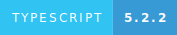
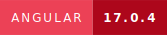
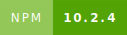
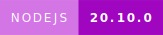
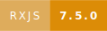
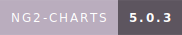
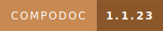

       


# OlympicGamesStarter

Olympic Games project shows some statistics about Olympic games and participants countries.

## Environment

- typescript 5.2.2
- angular 17.0.4
- npm 10.2.4
- nodeJS 20.10.0
- rxjs 7.5.0
- ng2-charts 5.0.3
- compodoc 1.1.23

## Installation

First install a node version manager like [nvm](https://github.com/nvm-sh/nvm#installing-and-updating).

Then install [Node.js and npm](https://docs.npmjs.com/downloading-and-installing-node-js-and-npm#using-a-node-version-manager-to-install-nodejs-and-npm) (node package manager).

Run `npm install -g @angular/cli` to install the latest version of Angular.

Run `npm install` to install your node_modules.

## Development server

Run `ng serve` for a dev server. Navigate to `http://localhost:4200/`. The application will automatically reload if you change any of the source files.

## Build

Run `ng build` to build the project. The build artifacts will be stored in the `dist/` directory.

## Folder structure

```
    src
    ├── app
    │   ├── core
    │   │   ├── components
    │   │   │   ├── footer
    │   │   │   ├── header
    │   │   │   └── statistics
    │   │   ├── models
    │   │   └── services
    │   └── pages
    │       ├── home
    │       ├── not-found
    │       └── single
    ├── assets
    │   ├── favicon
    │   ├── img
    │   │   └── doc
    │   └── mock
    └── environments

```

## Documentation

The documentation was generated with [Compodoc](https://compodoc.app/) version 1.1.23.

Run `compodoc -p tsconfig.doc.json -s --disablePrivate` to generate the documentation. Navigate to `http://localhost:8080`

## Test

Run `ng test` to test the project.

## Author

Gilles Bernard (@tipikae)

